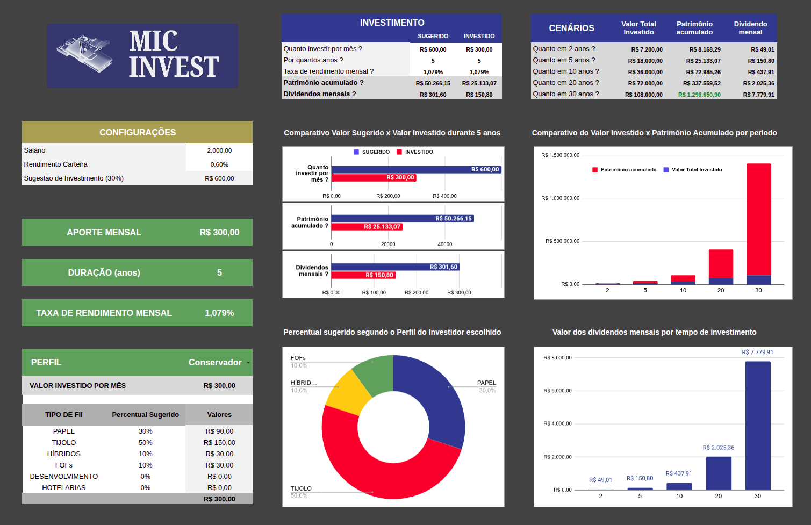

<!-- Banner session -->

  

<!--About session-->
<h1 align="center" style="color:#8257e6">Simulador de Investimentos em Fundos Imobiliários (FIIs)</h1>

 

  

 

<!-- Infos session -->
<h3> 💻 Projeto</h3>

A planilha contendo um Simulador de Investimentos em Fundos Imobiliários (FIIs) foi desenvolvida no Bootcamp Santander - Excel com Inteligência Artificial oferecido pela <a href="https://digitalinnovation.one/"> Digital Innovation One.</a>

📝 Projeto iniciado no Excel e finalizado no Google Sheets.

 

**Informações essenciais:**
- quanto investir por mês? (aporte mensal)
- por quanto tempo? (duração)
- taxa de rendimento mensal
- perfil do investidor (conservador, moderado ou agressivo)

 

**Informações calculadas para 2, 5, 10, 20 e 30 anos:**
- valor total investido
- patrimônio acumulado
- dividendo mensal
- sugestão de repartição (tipos de FII) do valor investido segundo o perfil do investidor

 

<!-- Tools session -->
<h3> 🚀 Tecnologias utilizadas</h3>

  <code> Excel</code>
  <code> Sheets</code>
  <code> VS Code</code>

 

<!-- Learnning session -->
<h3> 📚 Aprendizado </h3>

- Validação de dados
- Variáveis globais
- Formatação condicional
- Fórmulas
- Gráficos
- Estilizações
- Investimentos em Fundos Imobiliários
- Cálculos de rentabilidade

 

<!-- Contacts session -->
<h3> 👩🏼‍💻 Contatos </h3>

  <strong>&emsp; Michelle Cordeiro</strong> &emsp;
  <a href="https://www.linkedin.com/in/michelle-cordeiro/">
     LinkedIn
  </a> &emsp;
  <a href="michelle8cordeiro@gmail.com">
    
    E-mail: michelle8cordeiro@gmail.com
  </a>

 

<!-- Licences session -->
<h3 align="left"> 📝 License </h3>

  
  

 

<!--START_SECTION:footer-->

  

Made with 💙 by <a href="https://www.linkedin.com/in/michelle-cordeiro/">Michelle Cordeiro</a>

