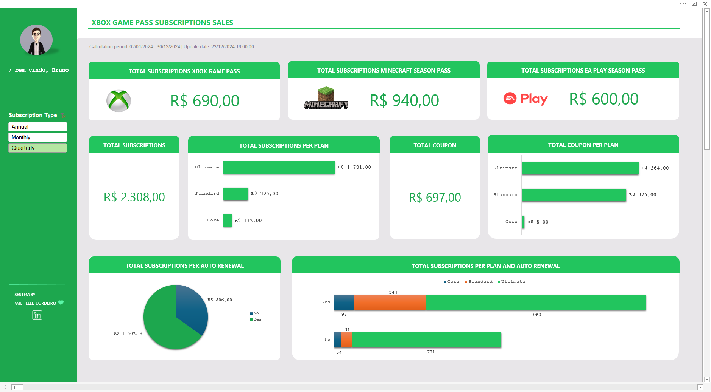

<!-- Banner session -->

  

<!--About session-->
<h1 align="center" style="color:#62A738">Dashboard de Vendas</h1>

 

  

 

<!-- Infos session -->
<h3> 💻 Projeto</h3>

Dashboard de vendas com foco na organização e visualização de dados, foi desenvolvido no Bootcamp Santander - Excel com Inteligência Artificial oferecido pela <a href="https://digitalinnovation.one/"> Digital Innovation One.</a>

O objetivo foi transformar dados brutos em informações visuais claras e úteis, permitindo uma análise eficaz do desempenho de vendas e a tomada de decisões baseadas em dados.
Todos os itens do dashboard apresentam os dados correspondente a seleção do tipo de assinatura *(subscription type)*: anual, trimestral e mensal.

 

<!-- Tools session -->
<h3> 🚀 Ferramenta utilizada</h3>

  <code> Excel</code>

 

<!-- Learnning session -->
<h3> 📚 Aprendizado </h3>

- Variáveis globais
- Fórmulas
- Tabelas dinâmicas
- Gráficos dinâmicos
- Segmentação de dados
- Proteção com desbloqueio de áreas específicas
- Fixação de imagens
- Estilizações diversas
- Dashboard

 

<!-- Contacts session -->
<h3> 👩🏼‍💻 Contatos </h3>

  <strong>&emsp; Michelle Cordeiro</strong> &emsp;

  <a href="https://www.linkedin.com/in/michelle-cordeiro/">
     LinkedIn
  </a> &emsp;

  <a href="michelle8cordeiro@gmail.com">
    
    E-mail: michelle8cordeiro@gmail.com
  </a>

 

<!-- Licences session -->
<h3 align="left"> 📝 License </h3>

  
  

 

<!--Footer session-->

  

Made with 💙 by <a href="https://www.linkedin.com/in/michelle-cordeiro/">Michelle Cordeiro</a>

